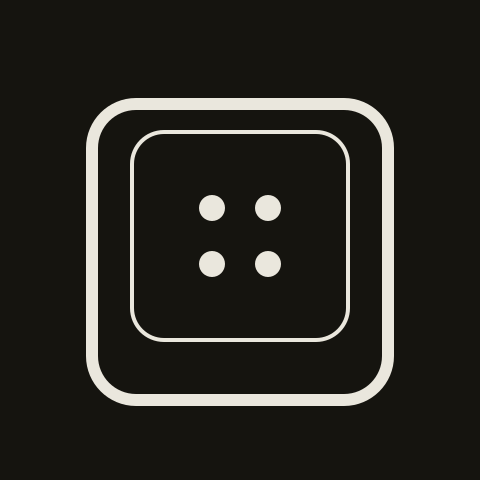
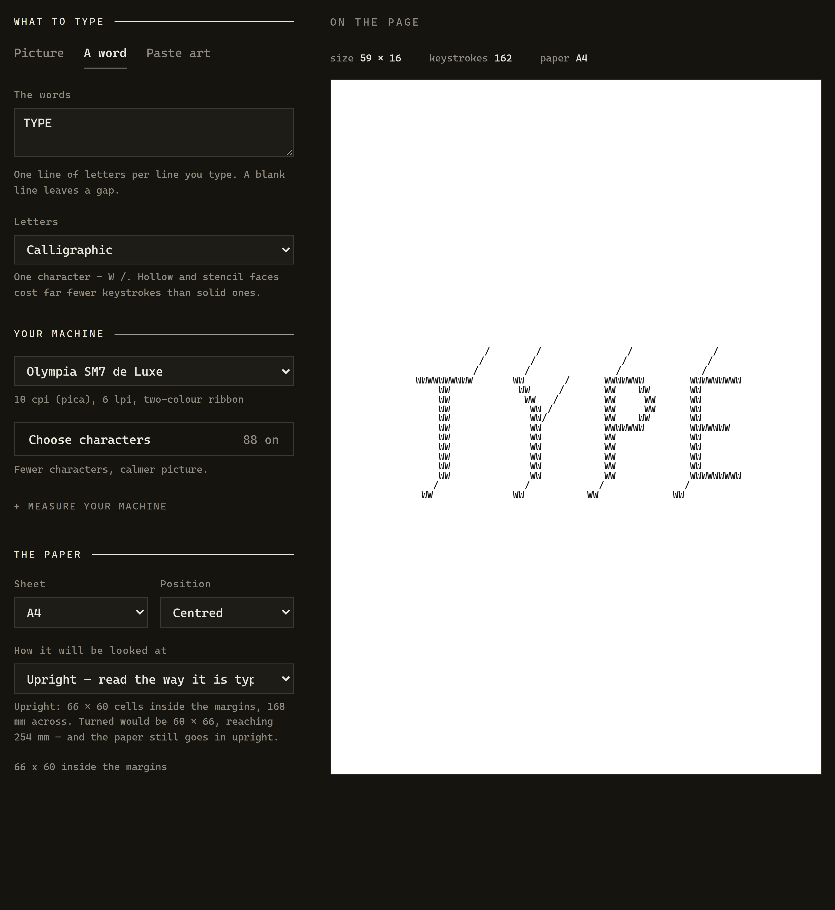
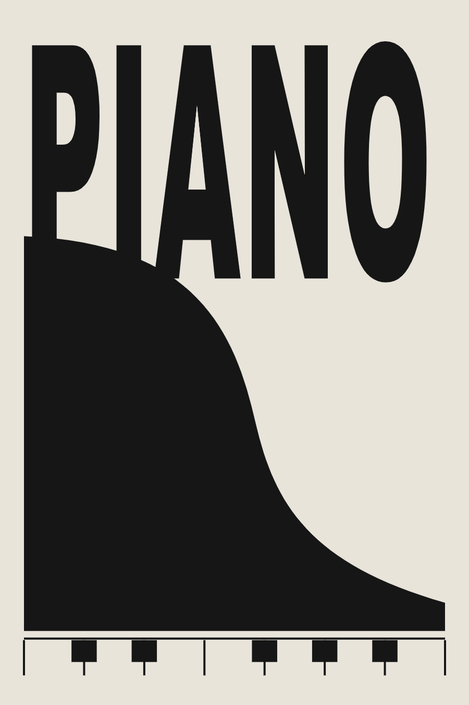
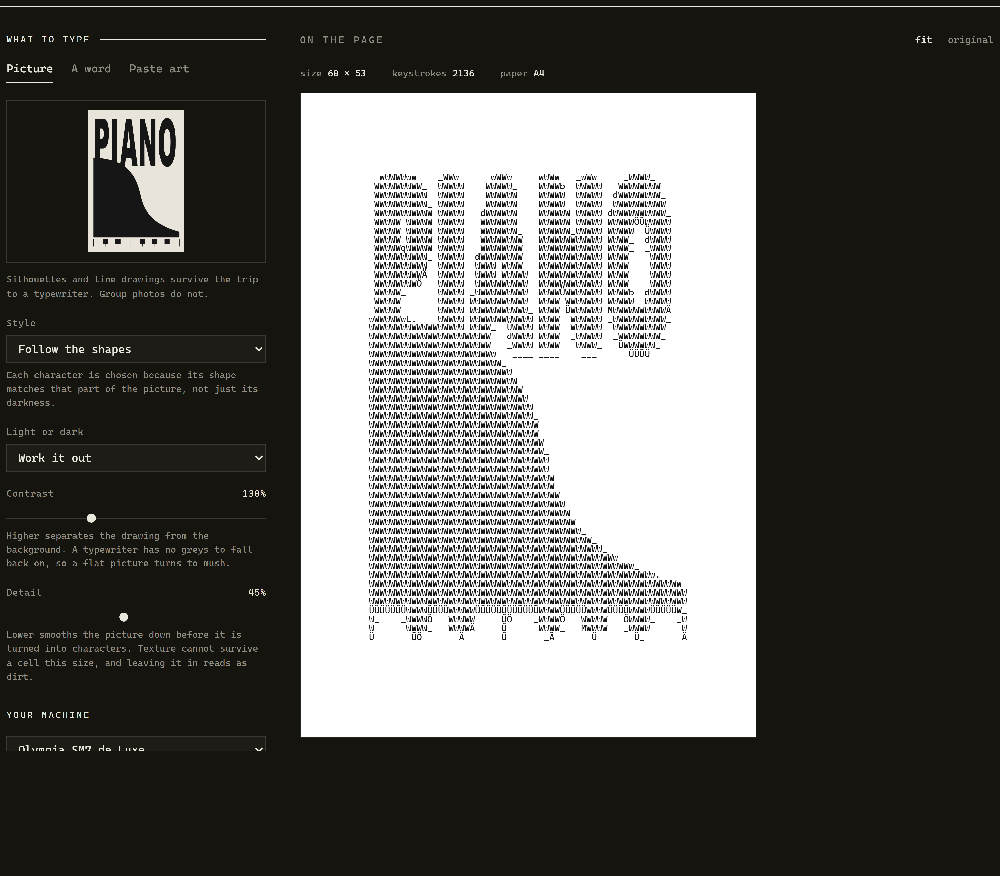
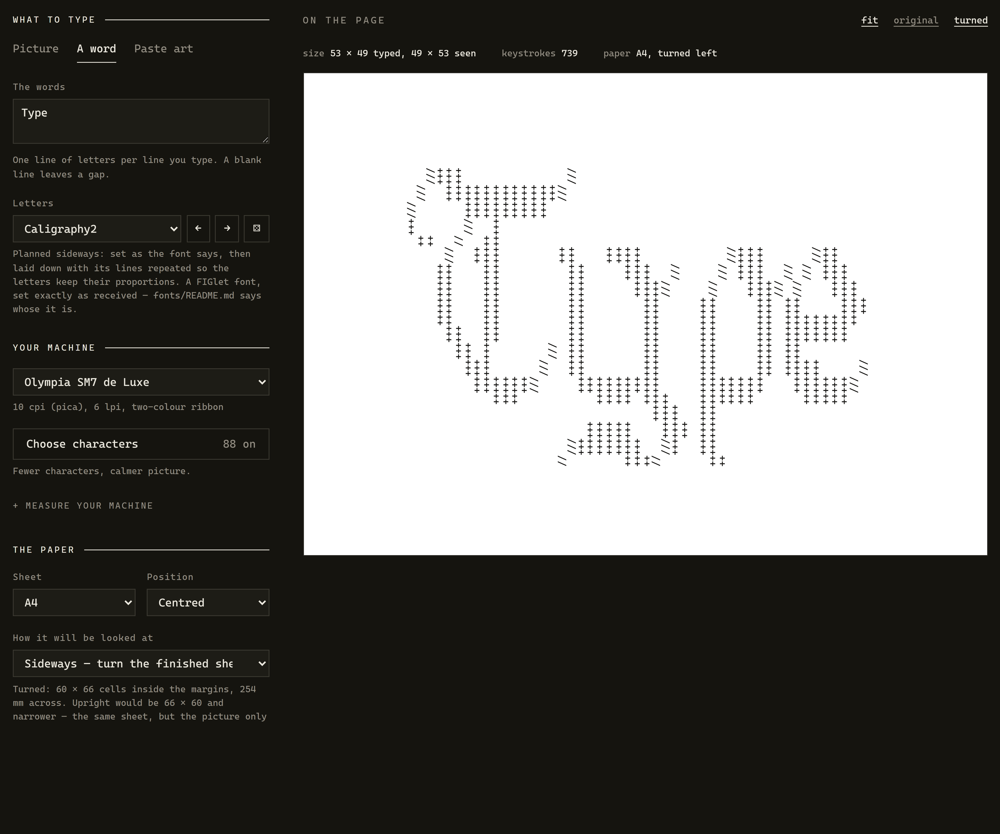
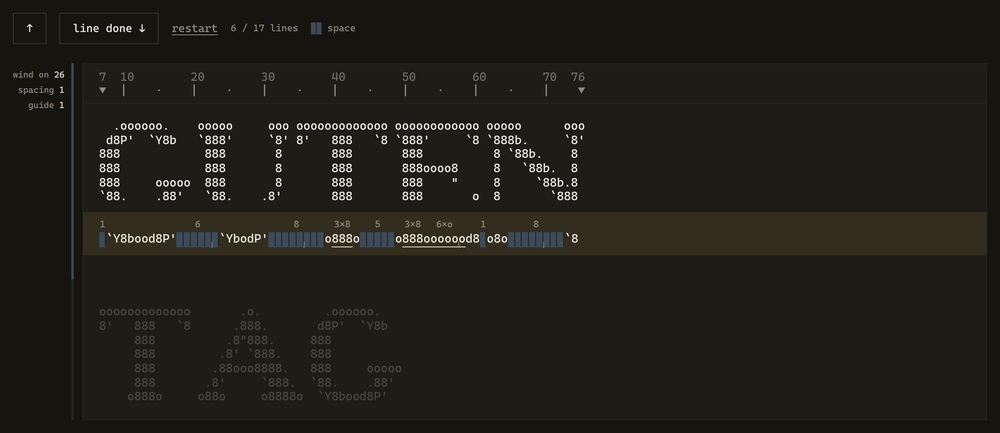

<div align="center">



<h1>Typewriter ASCII</h1>

<p><b>Turn images and text into ASCII art you can actually type on a mechanical typewriter.</b></p>

<p>
<a href="LICENSE"></a>


</p>

<p><a href="https://typewriter-ascii.vercel.app"><b>Try it in the browser</b></a> — it runs entirely on your machine. Nothing is uploaded.</p>

</div>

Not "ASCII art you look at on a screen". Art you sit down and type, one
keystroke at a time, on a machine with no undo. That constraint changes
everything about how it has to work.



<div align="center"><sub><code>Type</code> in Caligraphy2 — 49 × 19 characters, 264 keystrokes, counted before you sit down.</sub></div>

## Why this is not a normal ASCII generator

A generator that ignores the machine produces art that cannot be typed:

- **Every space is a keystroke.** Lose count in a run of eighteen spaces and
  everything after it shifts by one column. So spaces are counted, grouped in
  fives, and shown as explicitly as the characters.
- **Machines lack characters.** The Olympia SM7 has no zero — you type a
  capital `O`. No `@`, `#`, `$`, `*`, `[`, `]`, `<`, `>` either. Art using
  them is art you cannot type.
- **The margin stop has limits.** When a motif starts further left than the
  stop reaches, you do not move the stop — you move the *paper*, using the
  paper guide. The setup instructions work this out for you.
- **A two-colour ribbon is one pass per colour.** All the black first, then
  switch. The first strike after a switch smears, so strike twice on scrap.

## What it does

- **Images** → shape-matched characters, tone-matched characters, outline
  only, or a repeating sentence that reads continuously through the picture
- **Lettering** → words, or several lines of them, set in nineteen real
  FIGlet fonts — plus one drawn face no font file can be
  ([see below](#lettering))
- **Compose** → spread one motif over several sheets and lay them side by
  side. A typewriter's cell is 2.54 × 4.23 mm and nothing makes it smaller,
  so more paper is the only route to a bigger picture: 2 × 2 A4 is 164 × 140
  cells instead of 82 × 70
- **Sideways** → plan a motif to be *read* sideways. The paper still goes in
  upright — a typewriter cannot take A4 on its long edge — so the motif is
  laid down instead, typed on an upright sheet, and you turn the finished
  sheet a quarter turn. A 16:9 photograph goes from 168 × 93 mm to 254 × 142;
  a word is set as a picture, so the letterforms keep their proportions
- **Existing art** → paste it in; characters your machine lacks are swapped
  for the nearest shape it has, and you are told what changed
- **It fits, or it says why** → one *how wide* control governs pictures and
  words alike: a picture is scaled to it, a line of lettering breaks at
  spaces to reach it. A single word too wide to break is the one thing that
  cannot be wrapped away, so it is named at the box you typed it into, with
  the ways out offered as buttons
- **Setup instructions** → paper guide, margin stops, how far to wind on
- **A sheet you can follow** → the current line opens in place and shows what
  to type; the rest stays as motif so you always see where you are
- **Listening** → it counts your keystrokes by ear, and resets at every
  carriage return

## A picture, typed

Feed it a PNG — silhouettes, posters and line drawings survive the trip to a
typewriter; group photos do not. Each cell is matched against what your
machine's keys actually strike, so the characters can follow the shapes in
the drawing rather than just its darkness:

<table>
<tr>
<td width="34%"></td>
<td width="66%"></td>
</tr>
</table>

<div align="center"><sub>One poster in, 2,136 keystrokes out — with the margin stop and the wind-on worked out before you start.</sub></div>

<details>
<summary><b>The whole sheet as text</b> — the same poster tone-matched on the command line (62 × 55, 2,408 keystrokes)</summary>

```text
 .6BBBBBö'   `§BBn     (8BBn     nBB3   `GB8)     ZBBBg`
 6BBBBBBBB3  wBBBB`    BBBBB;   `BBBBm  3BBBB   ´BBBBBBB+
 ÄBBBBBBBBB/ kBBBB`   ;BBBBBT   `BBBBB  aBBBB   BBBBBBBBB'
 ÄBBBBBBBBBB kBBBB`   JBBBBBB   `BBBBB( eBBBB  IBBBBBBBBBB
 ÄBBBBBBBBBB kBBBB`   ÖBBBBBB   `BBBBBB 4BBBB  BBBBBBBBBBB´
 ÄBBBBiBBBBB`kBBBB`   BBBBBBB`  `BBBBBB`4BBBB "BBBBBBBBBBBC
 ÄBBBB 1BBBB´kBBBB`   BBBBBBB(  `BBBBBBoSBBBB %BBBB% /BBBBB
 ÄBBBB YBBBB`kBBBB`  /BBBBBBBe  `BBBBBBBeBBBB 8BBBB`  BBBBB
 ÄBBBB`BBBBB`kBBBB`  üBBBBBBBB  `BBBBBBBBBBBB BBBBB   BBBBB
 ÄBBBBBBBBBB kBBBB`  BBBBBBBBB  `BBBBBBBBBBBB BBBBB   EBBBB
 ÄBBBBBBBBBÖ kBBBB`  BBBB1BBBB' `BBBBBBBBBBBB BBBBB   UBBBB
 ÄBBBBBBBBB_ kBBBB` ´BBBB,BBBBi `BBBBBBBBBBBB BBBBB   äBBBB
 ÄBBBBBBBB4  kBBBB` =BBBB"BBBBH `BBBBBBBBBBBB BBBBB   RBBBB
 ÄBBBBBBB)   kBBBB` dBBBBBBBBBB `BBBBPBBBBBBB BBBBB   BBBBB
 ÄBBBB       kBBBB` BBBBBBBBBBB `BBBB)BBBBBBB äBBBB-  BBBBB
 ÄBBBB       kBBBB` BBBBBBBBBBB_`BBBBrÄBBBBBB LBBBBÖ yBBBBÄ
 BBBBB       kBBBB`:BBBBBBBBBBB1`BBBBr_BBBBBB `BBBBBBBBBBBx
EBBBBBBBBBö=.aBBBB`tBBBBBBBBBBBB`BBBBr BBBBBB  BBBBBBBBBBB
BBBBBBBBBBBBBBBBBB.QBBBB   BBBBB`BBBBr TBBBBB  (BBBBBBBBB5
BBBBBBBBBBBBBBBBBBBBBBBB   ÖBBBB:BBBBr `BBBBB   ÖBBBBBBBB
BBBBBBBBBBBBBBBBBBBBBBB9   LBBBB_BBBB,  HBBBB    DBBBBBB`
BBBBBBBBBBBBBBBBBBBBBBBB6   `::`  ,:`    `:'      `%Äm!
BBBBBBBBBBBBBBBBBBBBBBBBBBs
BBBBBBBBBBBBBBBBBBBBBBBBBBBB
BBBBBBBBBBBBBBBBBBBBBBBBBBBBB`
BBBBBBBBBBBBBBBBBBBBBBBBBBBBBB`
BBBBBBBBBBBBBBBBBBBBBBBBBBBBBBB
BBBBBBBBBBBBBBBBBBBBBBBBBBBBBBB6
BBBBBBBBBBBBBBBBBBBBBBBBBBBBBBBB/
BBBBBBBBBBBBBBBBBBBBBBBBBBBBBBBBB
BBBBBBBBBBBBBBBBBBBBBBBBBBBBBBBBBB,
BBBBBBBBBBBBBBBBBBBBBBBBBBBBBBBBBBBs
BBBBBBBBBBBBBBBBBBBBBBBBBBBBBBBBBBBB6
BBBBBBBBBBBBBBBBBBBBBBBBBBBBBBBBBBBBBB
BBBBBBBBBBBBBBBBBBBBBBBBBBBBBBBBBBBBBBB6
BBBBBBBBBBBBBBBBBBBBBBBBBBBBBBBBBBBBBBBBBö
BBBBBBBBBBBBBBBBBBBBBBBBBBBBBBBBBBBBBBBBBBB8"
BBBBBBBBBBBBBBBBBBBBBBBBBBBBBBBBBBBBBBBBBBBBBB8y'
BBBBBBBBBBBBBBBBBBBBBBBBBBBBBBBBBBBBBBBBBBBBBBBBBBg2=
BBBBBBBBBBBBBBBBBBBBBBBBBBBBBBBBBBBBBBBBBBBBBBBBBBBBBBBqY;
BBBBBBBBBBBBBBBBBBBBBBBBBBBBBBBBBBBBBBBBBBBBBBBBBBBBBBBBBBBB
'yBBBBBBBBBBBBBBBBBBBBBBBBBBBBBBBBBBBBBBBBBBBBBBBBBBBBBBBBBö
   `!fBBBBBBBBBBBBBBBBBBBBBBBBBBBBBBBBBBBBBBBBBBBBBBBBBBBg/
       ´(gBBBBBBBBBBBBBBBBBBBBBBBBBBBBBBBBBBBBBBBBBBBB2:
           `=uBBBBBBBBBBBBBBBBBBBBBBBBBBBBBBBBBBBBs"
                 ,tBBBBBBBBBBBBBBBBBBBBBBBBBBB('
                      "1BBBBBBBBBBBBBBBBBBd,
                           `=ÖBBBBBBBB8:
                                `!P('
```

</details>

Pictures are PNG only. Silhouettes and line drawings are what survives the
trip to a typewriter, and that material is already PNG; a JPEG decoder would
be several hundred lines of DCT earning its keep on photographs, which do
not survive the trip anyway. Anything else is turned away by name, with the
conversion command in the message.

## Lettering

Nineteen original FIGlet fonts, set with the real layout algorithm — full
width, kerning, and smushing with the six controlled rules of the FIGfont
standard — so the output is pixel for pixel what the TAAG site shows,
before the marks your machine lacks are swapped for what it can strike.
`Type` in Caligraphy2, on an Olympia SM7 (`#` typed as `+`):

```text
  /+++           /
 /  ++++++++++++/
/     +++++++++
+     /  +
 ++  /  ++
    /  +++      ++   ++++         /+++     /++
   ++   ++       ++    +++  /    / +++  / / +++
   ++   ++       ++     +++/    /   +++/ /   +++
   ++   ++       ++      ++    ++    ++ ++    +++
   ++   ++       ++      ++    ++    ++ ++++++++
    ++  ++       ++      ++    ++    ++ +++++++
     ++ +      / ++      ++    ++    ++ ++
      +++     /  ++      ++    ++    ++ ++++    /
       ++++++/    +++++++++    +++++++   ++++++/
         +++        ++++ +++   ++++++     +++++
                          +++  ++
                   +++++   +++ ++
                 /+++++++  /+  ++
                /      +++/     ++
```

The fonts ship in [`fonts/`](fonts/), redistributed **as received** and
credited to their authors in [`fonts/README.md`](fonts/README.md); they are
not covered by this repository's MIT licence. Any `.flf` you drop into the
folder works from the command line as it is, and joins the browser's picker
once it is named in [`fonts/index.json`](fonts/index.json):

```sh
node tools/cli.mjs text "HELLO" --flf fonts/Roman.flf
```

One face is still drawn by hand, because no font file can be it. The
classic isometric FIGlet faces all need a backslash, and a great many
typewriters — the SM7 among them — have no backslash key at all. The drawn
three-dimensional face uses *oblique* projection instead: every depth line
runs at the same 45-degree angle, so one `/` does the work of both
diagonals:

```text
  __________   __      __   ________     __________
 ///////////  ///     ///  /////////    ///////////
BBBBBBBBBB/  BB/ __  BB/  BBBBBBBB/ __ BBBBBBBBBB/
BBBBBBBBBB   BB /// /BB   BBBBBBBB /// BBBBBBBBBB
    BB//       BB/ BB/    BB      BB/  BB/ ______
    BB//       BB /BB     BB      BB   BB ///////
    BB//         BB//     BBBBBBBB/    BBBBBBBB/
    BB//         BB//     BBBBBBBB     BBBBBBBB
    BB//         BB//     BB//         BB/ ________
    BB//         BB//     BB//         BB /////////
    BB/          BB/      BB/          BBBBBBBBBB/
    BB           BB       BB           BBBBBBBBBB
```

Fonts are set in their own marks — Caligraphy2 really does say `#` — and
the machine is met at the end by a stand-in engine: a substitution table
for the judgement calls, a measured shape match for everything else, and an
honest note about what changed (`Typed # as +`). Only a mark with nothing
at all to stand in for it is left blank, by name.

Keystrokes vary a lot between fonts, which matters when you are the
printer: `TYPE` costs 327 keystrokes in the three-dimensional face, and
`Type` in Caligraphy2 costs 264. How the stand-in engine works, how a word
is fitted to the paper, and what planning one sideways does:
**[docs/lettering.md](docs/lettering.md)**.

## Compose

A typewriter has one resolution. A cell is 2.54 mm by 4.23 mm at pica, the
machine cannot make a smaller one, and an A4 therefore holds 82 columns by 70
lines and never any more. Past that the only thing left to change is the
amount of paper.

So: pick **Compose — several sheets…** at the bottom of the sheet list, point
at a shape in the matrix, and the motif is laid out across that many sheets.
Each one is typed on its own, with its own margin stops and its own wind-on,
and you lay them out afterwards.

| A4 at 10 cpi | cells | paper |
| --- | --- | --- |
| 1 sheet | 82 × 70 | 210 × 297 mm |
| 2 × 1 | 164 × 70 | 420 × 297 mm |
| 2 × 2 | 164 × 140 | 420 × 594 mm |
| 4 × 4 | 328 × 280 | 840 × 1188 mm |

**No cell ever straddles a join.** This sounds obvious and it decides the
whole design. Two A4 butted together are 420 mm, and 420 mm divided by the
cell is 165 columns — one more than the 164 the two sheets hold between them.
That extra column is real arithmetic and useless: it lands half on each sheet,
where no type bar can reach it. So the composite grid is the single sheet's
grid *multiplied*, never the composite's millimetres divided.

**Overlap the sheets when you lay them out.** The leftover has to go
somewhere, and it piles up at the joins: 82 columns is 208.28 mm of a 210 mm
sheet, so butt two together and 1.72 mm of blank paper sits between the last
column of one and the first of the next. Slide them over it and the picture
closes up. The setup instructions give you the number for your machine and
paper.

**Sheets side by side are safer than sheets stacked.** The carriage reaches
both edges of a sheet, so a side join costs only that millimetre and a half.
A join *above and below* is different: the feed rollers have to grip the paper
for the platen to turn it, and near the bottom of a sheet they let go — so the
last lines of each row may not be typeable at all. How many depends on the
machine, and this app has not measured it on any of them, so it says so and
leaves the judgement to you rather than inventing a number.

**One sheet at a time, and not as a convenience.** On a composite two sheets
wide, a single row of the motif is a hundred and something columns and no
line on the machine is: it is two lines, on two pieces of paper, typed on two
separate visits. There is no arrangement in which the whole picture is one
list of lines to work down. So the typing panel always shows one physical
sheet, numbered from line one, and the sheet chooser sits above it in the
shape of the paper.

**Composing and turning are independent.** The matrix decides how much paper;
*Sideways* decides which way the finished thing is read. Both at once is a
perfectly ordinary thing to want — a wide panorama across three sheets, read
sideways — and neither knows about the other.

## Sideways

This got a whole rewrite, because the first version of it was wrong.

Landscape used to mean *feed the sheet in on its long edge*. It reads well.
A4 on its long edge is 297 mm of writing line, and an Olympia SM7's carriage
scale ends at 98 — 249 mm. The app offered 116 columns for which there was
no carriage, and reported it as notes rather than a refusal.

The paper goes in upright. What can be planned is the *motif*: laid on its
side, typed on an upright sheet with the machine set up exactly as usual,
and the finished sheet turned a quarter turn to be looked at. The type bars
still strike one way only, so the glyphs end up lying down — which costs a
picture nothing worth having, because what carries a picture is how much ink
is in each 2.54 × 4.23 mm cell.

**It buys millimetres, not columns.** The same sheet with the same margins
holds the same cells either way; turning only stands them the other way up:

| A4 at 10 cpi, inside the margins | cells | across the paper |
| --- | --- | --- |
| upright | 66 × 60 | 168 mm |
| planned sideways | 60 × 66 | 254 mm |

So a wide picture comes out half as big again, and gains its detail down the
other axis — two and a third times the keystrokes for one and a half times
the picture. Which way you turn the finished sheet is offered, because both
are real: identical at the machine, differing only in which corner is typed
first. And marks in turned pasted art are swapped for what will look right
afterwards — an underscore has to be struck as something that *looks* like
an underscore once the sheet has moved under it; where no honest swap
exists, the original stands.

**A word planned sideways keeps its own marks.** A quarter turn swaps the
cell's 2.54 mm width and its 4.23 mm height, so a block laid down cell for
cell comes out stretched by the ratio twice over — 2.77 times, which reads
as a smear. It is given those lines back instead: each line repeated 2.77
times, so the cells come out the shape they started in and every mark is
still the one the font set. A `+` is the same mark whichever way the paper
is held, and nothing about a turn is a reason to go looking for another one.



<div align="center"><sub><code>Type</code> in Caligraphy2 again — 124 × 80 mm upright, 207 × 135 mm read sideways. Two thirds again as big, in proportion, in the same marks.</sub></div>

A block too deep to be laid down that way would run off the paper, and
squeezing it back would drop whole strokes — a hairline is one cell wide.
That one case goes through the picture pipeline instead, matched cell by
cell against your keys, and the app says so rather than quietly changing
the alphabet.

## Typing it

The whole point is that you never reach for the screen. The line you are on
opens up and shows what to strike — spaces counted and grouped, runs as a
count — and the rest stays as motif, so you always see where you are:



**The machine's settings are drawn, not listed.** Where to set the margin
stop, how far to wind the paper on and where the lines will end are all
*places*, so they are places: a carriage scale along the top of the sheet,
numbered the way your machine is numbered and marked at both stops, and the
feed down the side with the wound-past part shaded. Nothing has to be read
off a list and found on the machine by hand.

**Space, Enter or ↓** move to the next line, **↑** goes back. And the
microphone can count the strikes *within* the line: **listening** is onset
detection on the audio clock, with a threshold relative to the room — no
machine learning and nothing uploaded. The carriage return resets the count,
so an error is confined to the line it happened on. And when the count
cannot be trusted, it *says it is lost* and asks where you are, instead of
showing a column it cannot stand behind: you are looking at the paper, not
the screen, and the machine has no undo. If the defaults do not suit your
machine, **calibrate** measures it — type twenty characters and it fits the
timing to your typewriter's rebound.

The reasoning, the measurements and the sources for the listening feature,
including what remains unproven, are written up in
**[docs/listening-research.md](docs/listening-research.md)**.

## Your machine

Machine profiles are plain data in
[`src/profiles/index.js`](src/profiles/index.js) — copy the closest entry,
change what differs, open a pull request. Nothing else needs to know. Full
instructions, including how to measure a machine you know nothing about:
**[docs/adding-a-machine.md](docs/adding-a-machine.md)**.

The pitch — how far the carriage steps for each character — is worth
measuring even on a machine already listed, because the same model was often
built in both. **Measure your machine** walks you through it: type forty
capital M, measure first to last, and the page resizes itself around the
answer. It refuses to guess when the reading falls between the two standard
pitches, rather than rounding a mistake into every sheet you ever type.

If you would rather not think about layouts at all, the **characters**
dialog has *learn from typing*: press every key your machine has and it
records what they produce.

Half spacing sideways and downwards, typing outside the margin stops, the
invisible ribbon setting for rehearsing a line, and why the underscore
prints black when you have selected red:
**[docs/machine-tricks.md](docs/machine-tricks.md)**.

## Running it

No build step, no dependencies. It is ES modules and one stylesheet:

```sh
python3 -m http.server 8000     # or any static server
```

Then open `http://localhost:8000` — or use the hosted copy at
**[typewriter-ascii.vercel.app](https://typewriter-ascii.vercel.app)**.
Either way everything runs in your browser; no image or audio leaves it.

**The microphone needs `https` or a locally-opened file.** Browsers refuse
it over plain `http` on a network address — that is a browser rule, not a
bug here.

### From the command line

Same modules, no browser, no dependencies:

```sh
node tools/cli.mjs machines
node tools/cli.mjs text "HELLO" --flf fonts/Roman.flf
node tools/cli.mjs text 'PIANO\nSTIMMER' --flf fonts/Georgia11.flf
node tools/cli.mjs text "HELLO" --style oblique
node tools/cli.mjs file rose.txt --paper a4 --red 0-15 --pdf out.pdf
node tools/cli.mjs image drawing.png --mode tone --turn left --pdf out.pdf
```

`--json` on any command puts the whole result on stdout as one object —
size, keystrokes, margin stops, warnings, and the lines themselves — so a
script or an agent never has to parse the human output. Failures use the
same shape (`{"ok": false, "error": …}`) and exit non-zero, rather than a
stack trace where the answer should be. Full reference, including the JSON
shapes: **[docs/command-line.md](docs/command-line.md)**.

### Why did my picture come out like that?

`inspect` reports what each step of the pipeline did to the ink, and says
what it makes of the result — here on the poster above:

```text
$ node tools/cli.mjs inspect docs/img/piano-poster.png
docs/img/piano-poster.png — 600×900 working size, mode shape, contrast 130%, detail 45%
strokes 61.7 px across 46.6% of the frame — dense enough to blur fully at 5.0 px

stage       size        strongest   average   inked
ink         600×900         0.914    0.4805  100.00%
blur        600×900         0.914    0.4805  100.00%
normalise   600×900         1.000    0.4638   57.34%
contrast    600×900         1.000    0.4631   53.50%
crop        553×817         1.000    0.5535   63.94%

grid 60 × 53, 2143 of 3180 cells inked, 2245 keystrokes
```

**strongest** is the darkest single pixel; under `0.04` nothing is typed at
all, so a value below that means an empty sheet and the finding will name
the step that caused it. **average** should stay roughly level across the
blur — a drop there means ink was destroyed rather than spread. Too *much*
ink is reported as well, because a sheet that is 97% inked is a negative
nobody turned round, and that one looks like it worked until you sit down
to type it. `--preview out.png` writes the prepared image, which answers the
other half of the question: the numbers say the ink survived, the picture
says whether it still looks like the drawing.

### Shapes on the command line

"Follow the shapes" compares each cell against a *rendered* copy of every
character, and rendering needs a canvas. Without one the command line
matches by tone instead and says so — it does not quietly hand back a shape
match that is really a tone match. To get the real thing, measure the glyphs
once in a browser and pass them along:

```sh
python3 -m http.server 8000      # then open /tools/atlas.html
node tools/cli.mjs image drawing.png --mode shape --atlas atlas-olympia-sm7.json
```

### Tests

```sh
npm test               # core, pictures, png, the cli itself, sheet, pdf, strikes
npm run test:browser   # loads the real page in jsdom and drives it
```

Among other things the suite proves the promise the whole project makes:
nothing reaches the sheet that the machine cannot type.

## Reading further

| | |
| --- | --- |
| [docs/command-line.md](docs/command-line.md) | Every command and flag, and the JSON shapes |
| [docs/lettering.md](docs/lettering.md) | The fonts, the stand-in engine, and setting a word sideways |
| [docs/adding-a-machine.md](docs/adding-a-machine.md) | Measuring and adding a machine profile |
| [docs/machine-tricks.md](docs/machine-tricks.md) | Things the machine can do that a printer cannot |
| [docs/listening-research.md](docs/listening-research.md) | The listening maths: measurements, sources, open questions |
| [fonts/README.md](fonts/README.md) | The FIGlet fonts: whose they are, and how to add more |

## Prior art

The shape-matching mode follows Xu, Zhang and Wong, *Structure-based ASCII
Art* (SIGGRAPH 2010). The insight worth stealing: match the **shape** of a
character against the shape of the cell, not just its darkness. Tone
matching alone gives you halftone mush; shape matching gives you something
that reads as a drawing.

The lettering comes from the FIGlet project (figlet.org) and its decades of
contributors: the `.flf` format, the layout algorithm implemented here from
the FIGfont standard, and the nineteen fonts themselves, which are the work
of their authors and are named in [fonts/README.md](fonts/README.md).

## Contributing

Machine profiles are plain data and are meant to grow; so is the font
folder, where an `.flf` and a line in `index.json` is the whole of it. Open
a pull request — and keep `npm test` green: among other things it sets
every bundled font and every drawn face in every letter and digit, and
fails if a single character is not on the machine.

## Licence

MIT — see [LICENSE](LICENSE). The FIGlet fonts in [`fonts/`](fonts/) are the
work of their authors, redistributed as received, and are not covered by it;
[`fonts/README.md`](fonts/README.md) names them.
